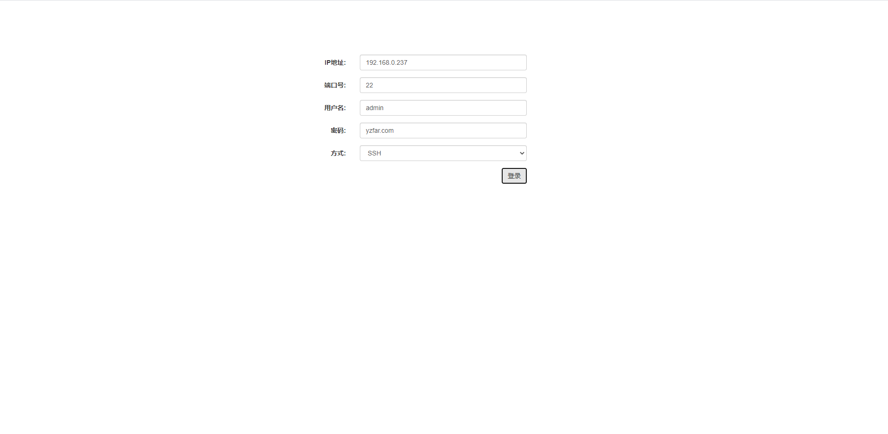

由于长期从事运维开发的工作，我本人也是一位运维厂商的开发人员，之前写了基于浏览器H5的ssh和telnet登录工具，用起来还是比cs架构的方便，稍微加工之后可以用来做审计或者运维网管方面的工具，目前国内的运维厂商还没有集成出这种工具，或者做出来的东西远远没有达到理想的要求，本着互联网开放共享的原则，开放源代码出来，希望能够帮助到相关的人员，也希望大家不要做拿来主义，分享自己的东西，项目采用java开发，使用其他语言开发的话我想看过源码之后也很容易移植，先截两张图

